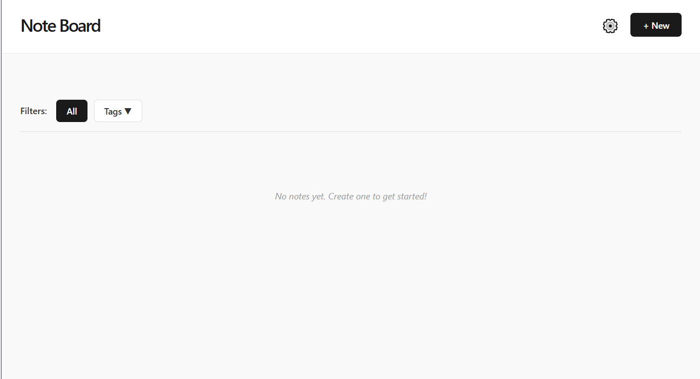
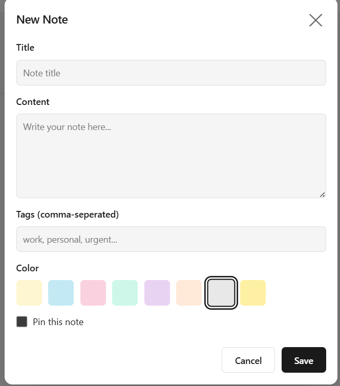

# Note Board

CodePath WEB103 Final Project

Designed and developed by: Olha Sorych, Sing Zheng, and Jonatan Paulino

🔗 Link to deployed app:

## About

### Description and Purpose

Note Board is an interactive notes app where users can create, edit, and delete notes, organize them into categories, add tags, and customize them with different colors.

This app is designed to make the note-taking process more organized, easy to navigate, and reliable. Users can capture notes anytime without worrying about losing them. The app ensures that all notes are stored safely and remain easy to find when needed.

### Inspiration

The inspiration for Note Board came from the common struggle of managing "digital scrap" those quick thoughts, links, and to do lists that often get lost in cluttered messaging apps or physical sticky notes. We wanted to build a centralized, visually intuitive space that mimics the flexibility of a physical corkboard but adds the power of digital searching, tagging, and categorization.

## Tech Stack

Frontend:   React

Backend:    Express

## Features

### Baseline Features
✅ The web app includes an Express backend app and a React frontend app.

- The web app includes dynamic routes for both frontend and backend apps.

- The web app is deployed on Render with all pages and features working.

**Backend Features**
✅ The web app implements at least one of each of the following database relationship in Postgres:
    ✅ one-to-many (user-notes: a user can have many notes, but each note belongs to one user)
    ✅ many-to-many with a join table (tags-categories: a tag can be in many categories and a category can use many tags)

- The web app implements a well-designed RESTful API that:
    - supports all four main request types for a single entity: GET, POST, PATCH, and DELETE
        - the user can view items, such as notes
        - the user can create a new item, such as a notes
        - the user can update an existing item by changing some or all of its values, such as changing the title of note
        - the user can delete an existing item, such as a task
    - Implements proper naming conventions for routes.

- The web app includes the ability to reset the database to its default state.

**Frontend Features**
✅ The web app implements at least one redirection, where users are able to navigate to a new page with a new URL within the app (Login -> Registration)

https://github.com/user-attachments/assets/cc5ed96b-e635-413f-b6ed-8ac31498f60f

✅ The web app implements at least one interaction that the user can initiate and complete on the same page without navigating to a new page. (Add Note)

- The web app uses dynamic frontend routes created with React Router.

✅ The web app uses hierarchically designed React components:
    ✅ Components are broken down into categories, including page and component types.
    ✅ Corresponding container components and presenter components as appropriate.

- The project is deployed on Render with all pages and features that are visible to the user are working as intended

### Custom Features
✅ The web app gracefully handles errors.

https://github.com/user-attachments/assets/72fc76ed-f51f-4654-8566-8d72e1919d55

✅  The web app includes a one-to-one database relationship (user has many notes, but each note belong to one user)

✅ The web app includes a slide-out pane or modal as appropriate for your use case that pops up and covers the page content without navigating away from the current page. (Add note modal)

https://github.com/user-attachments/assets/e29e2bdc-823d-4c9f-83f6-7d398cafd1d0

- The user can filter or sort items based on particular criteria as appropriate for your use case. (users can filter notes using categories and tags)

✅ Data submitted via a POST or PATCH request is validated before the database is updated (Password validation)

https://github.com/user-attachments/assets/1359b054-3f5e-4ffe-b921-6bf66f41382e

### [Full CRUD Functionality]

Users can seamlessly create new notes, view them in a gallery or list format, update content in real-time, and delete notes they no longer need.

### [Dynamic Categorization]

✅ Organize notes into specific categories (e.g., Work, Personal, School) to keep different areas of life separated and manageable.

### [Pinned Favorites]

The ability to "pin" important notes to the top of the dashboard so that high priority information is never buried.

### [Color-Coded Customization]

✅ Assign unique background colors to each note, allowing for visual grouping and a personalized aesthetic. 

### [AI Smart-Fix (Text Correction)]

A "Magic Wand" tool that instantly corrects grammar, spelling, and punctuation errors within a note while preserving the user's original intent.

### [Tone Shifter]

Allows users to rewrite a note in a different tone transforming a casual brainstorm into a professional email draft or a formal set of instructions.

## Installation Instructions

Follow these steps to set up the Note Board development environment on your local machine.

### Stretch Features
✅ A subset of pages require the user to log in before accessing the content.
    - Users can log in and log out via GitHub OAuth with Passport.js.

https://github.com/user-attachments/assets/f448133e-12b8-4423-bf67-09256f2dda69

📋 Prerequisites
Ensure you have the following installed:

Node.js

npm 

Git

1. Clone the Repository
Open your terminal and run:

git clone <https://github.com/colaola20/web103_finalproject.git>
cd web103_finalproject/FUN

2. Install All Dependencies
We use a monorepo structure. You need to install dependencies in three locations: the root, the backend, and the frontend.

#### > Install root dependencies (concurrently)
npm install

#### >  Install backend dependencies
cd backend && npm install

#### >  Install frontend dependencies
cd ../frontend && npm install

#### >  Return to the root folder
cd ..

3. Running the AppFrom the root directory (/FUN), start both the frontend and backend simultaneously.

npm run dev

Service     URL                     Description
Frontend    http://localhost:5173   Vite + React Development Server
Backend     http://localhost:3000   Express API Server
