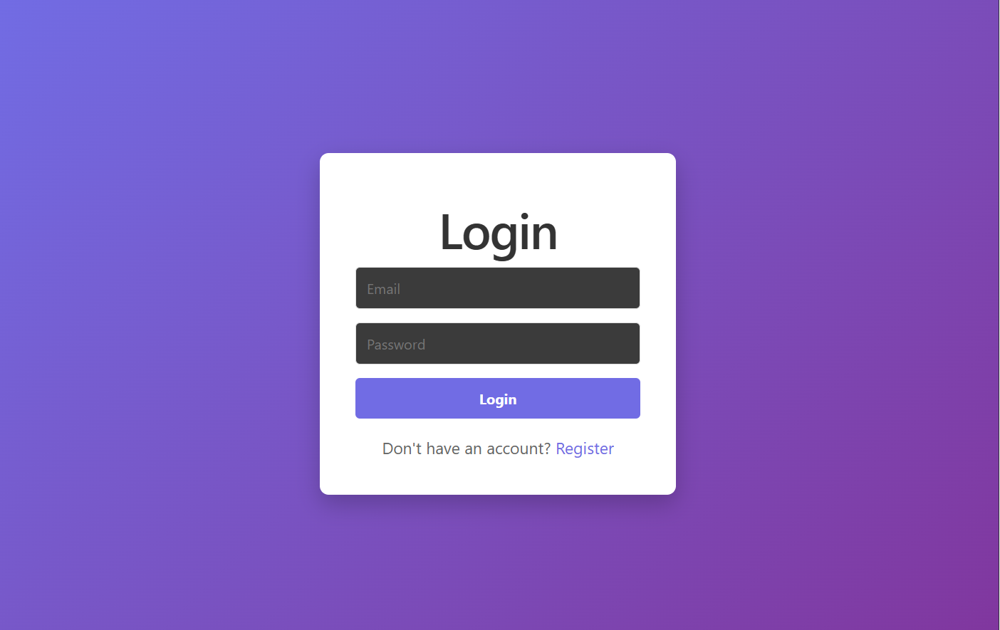
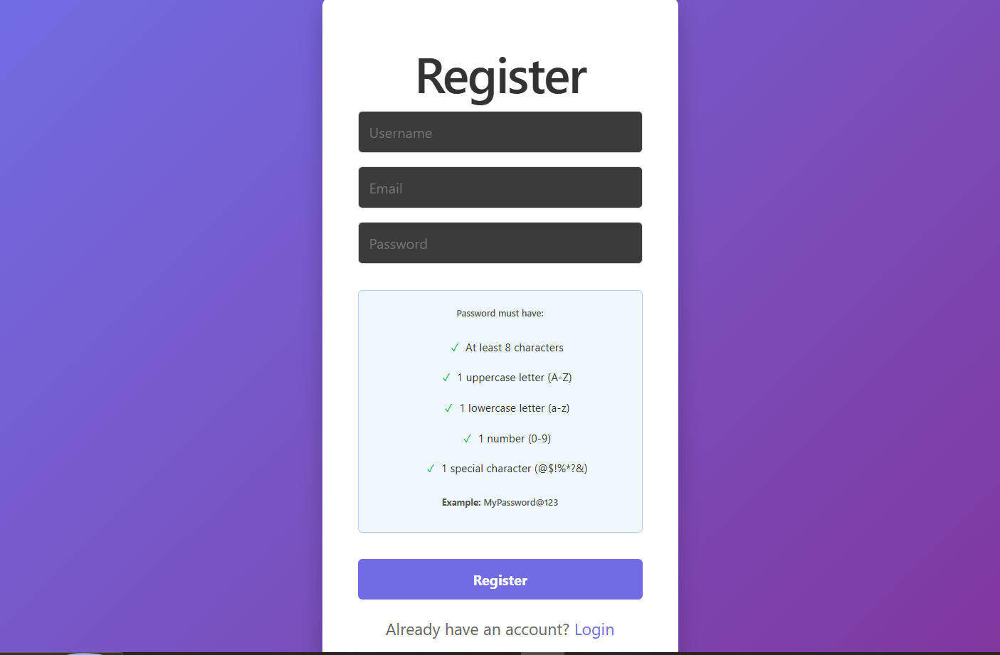

# Milestone 3

This document should be completed and submitted during **Unit 7** of this course. You **must** check off all completed tasks in this document in order to receive credit for your work.

## Checklist

This unit, be sure to complete all tasks listed below. To complete a task, place an `x` between the brackets.

You will need to reference the GitHub Project Management guide in the course portal for more information about how to complete each of these steps.

- [x] In your repo, create a project board. 
  - *Please be sure to share your project board with the grading team's GitHub **codepathreview**. This is separate from your repository's sharing settings.*
- [ ] In your repo, create at least 5 issues from the features on your feature list.
- [ ] In your repo, update the status of issues in your project board.
- [ ] In your repo, create a GitHub Milestone for each final project unit, corresponding to each of the 5 milestones in your `milestones/` directory. 
  - [ ] Set the completion percentage of each milestone. The GitHub Milestone for this unit (Milestone 3 - Unit 7) should be 100% completed when you submit for full points.
- [X] In `readme.md`, check off the features you have completed in this unit by adding a ✅ emoji in front of the feature's name.
  - [X] Under each feature you have completed, include a GIF showing feature functionality.
- [X] In this documents, complete all five questions in the **Reflection** section below.

## Reflection

### 1. What went well during this unit?

The team successfully established a robust backend API and authentication system. We have a clear contract between the frontend and backend thanks to the detailed API documentation. Collaboration has been strong, with clear communication regarding branch management and feature ownership.

### 2. What were some challenges your group faced in this unit?

One challenge was managing git branches; as we were working on interdependent features (backend routes and frontend UI), we had to ensure code was merged in the correct order to avoid significant conflicts. Additionally, we had to decide on the logic for category creation—specifically whether categories should be pre existing or created on the fly.

### Did you finish all of your tasks in your sprint plan for this week? If you did not finish all of the planned tasks, how would you prioritize the remaining tasks on your list?

Yes, the core authentication and backend infrastructure are complete. The remaining tasks involve connecting the frontend UI to the new endpoints. I would prioritize the Note CRUD operations first, as that is the core value of the app, followed by the Category/Tag filtering and finally the AI tools.

### Which features and user stories would you consider “at risk”? How will you change your plan if those items remain “at risk”?

The AI-assisted features (Smart-Fix and Tone Shifter) are at risk because they require external API integration and more complex prompt engineering. If we fall behind, we will focus on perfecting the "Core" note-taking experience first and implement the AI features as a "stretch goal" for the final milestone.

### 5. What additional support will you need in upcoming units as you continue to work on your final project?

We may need assistance with deploying the full-stack application (frontend and backend) to a production environment to ensure the database and environment variables are handled securely.

## Others features done

### Login

### Registration

